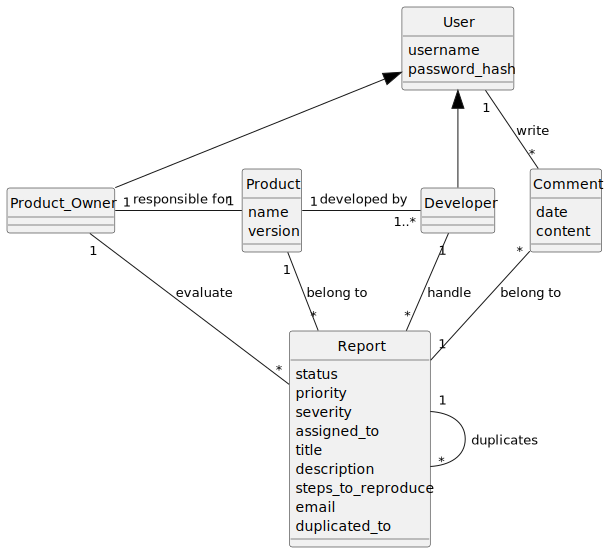

# COMP 3297 Group G Project BetaTrax
This project is aims at making BetaTrax, a software that links beta testers to developers and product owners.

## How to Use
### Installation
- git clone https://github.com/LinChengHao3606307/COMP_3297_Group_G_Project` in your desired directory
- Make sure Python 3.12+ (I'm on 3.14.0) is installed
- Make a virtual environment in your favourite way (ie, uv, venv, conda etc.) Install all python package dependencies using `pip install -r requirements`. The library versions are the latest as of 24/3/2026. Later versions should work but just in case
- Enter the root of the project directory and enable virtual environment with `source venv/Scripts/activate` (Linux) or `.\venv\Scripts\Activate.ps1` (Windows)
- `cd src` to get to the root folder of the code or else all `python manage.py` won't work
- make sure betatrax/settings.py has the following setting for connecting to PostgreSQL
```
        'NAME': 'betatrax_db',
        'USER': 'postgres',
        'PASSWORD': '3297',
        'HOST': 'localhost',
        'PORT': '5432',
```
Follow the order below and run all commands
```bash
python cleanAllMig.py
python manage.py makemigrations
python manage.py migrate_schemas --shared
python manage.py create_public_tenant --domain_url betatrax.localhost --owner_email admin@betatrax.localhost`
python manage.py createsuperuser` ## to create a user like `sup@betatrax.localhost` that can access admin page. The admin page is `http://betatrax.localhost:8000/admin`
python manage.py runserver` ## to run the server
```

### Commands to start the server
- `python manage.py runserver` to run the server

### First time setup for brand new server / databases
1. enter admin page (link: http://betatrax.localhost:8000/admin)
2. create tenant in Tenant model
3. link tenant to a subdomain in Domain (link has to be ended with .localhost if you do not have a hostname)
4. go to http://yourlink.localhost:8000/users/register/ to create new users

### Instructions and API references
API references are provided in schema.yaml at [here](/src/schema). For online webpage view, please go to [public hosting](#public-hosting) section. 

### Public Hosting
This service is currently hosted on http://comet13579.tplinkdns.com:8000/. For a visualized view of api documents, please visit http://comet13579.tplinkdns.com:8000/api/schema/redoc/ or http://comet13579.tplinkdns.com:8000/api/schema/swagger-ui/ 


## Important docs:
- [vision doc](https://connecthkuhk-my.sharepoint.com/:w:/g/personal/u3606307_connect_hku_hk/IQD9kZZRnJiPTIxSGjKxoOG3Aex-NwIiyNTZywPfMKIx8PU?e=etTHGP)

- [use cases](https://connecthkuhk-my.sharepoint.com/:w:/g/personal/u3606307_connect_hku_hk/IQBa1r0PS0pQR6NRAKoLVzM7AddIPb8K779ircAi1OqJM6I?e=13hz48)

- [Product Backlog](https://connecthkuhk-my.sharepoint.com/:x:/g/personal/u3606307_connect_hku_hk/IQDszGtNJjNdQKKexfxhkStGATP01ZpfdjPUzL_VmQUFKXg?e=bDNYVA)

- [UI Storyboard](/COMP3297_Group_G.pdf)

- [Domain Model](#domain-model)

- [Contributions](#contributions.md)


## Domain Model

