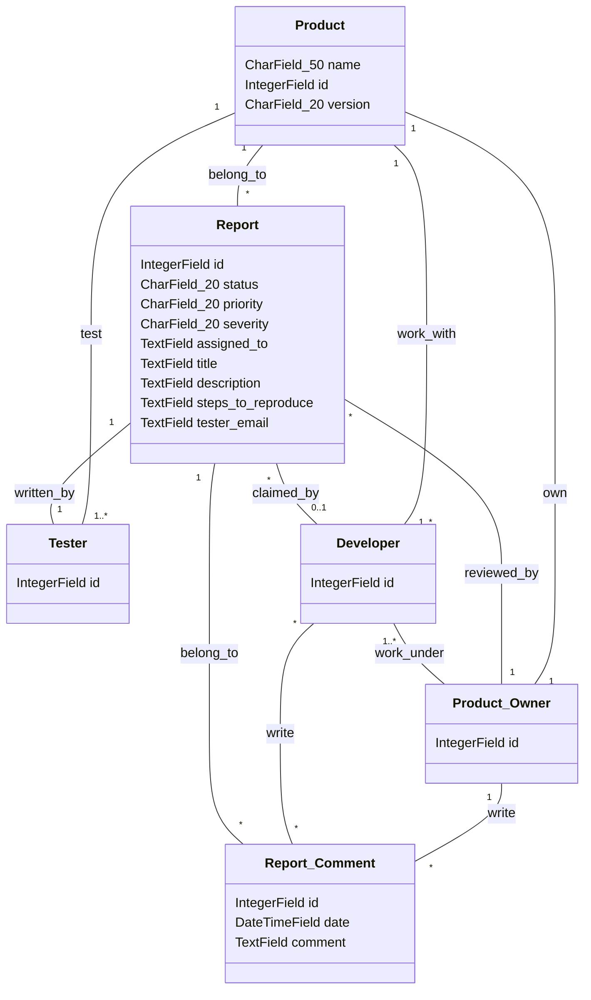

# COMP 3297 Group G Project

## Instructions for groupmates
### First time stuff
- Make sure Python 3.12+ (I'm on 3.14.0) is installed
- Make a virtual environment using `requirements.txt`. The library versions are the latest as of 24/3/2026. Later versions should work but just in case
- `cd src` to get to the root folder of the code or else all `python manage.py` won't work
- `python manage.py migrate` to create a database on your side. Don't track it with git plz
- `python manage.py createsuperuser` to create a user that can access admin page. The admin page is `http://127.0.0.1:8000/admin`

### Always remember
- Pull from remote before working
- `cd src` before `manage.py` stuff
- Don't push venv, cache, IDE settings file onto git repo e.g.  `.venv` `.idea` `.vscode/`. The `.gitignore` should take care of this tho
- Don't update stuff without testing that they work
- Don't commit everything at once. If you made very different changes on two files, commit twice with proper message
- Don't forget to actually push your changes
- Feel free to ask if you are not unsure about something. Explaining is faster than debugging :D

## Important docs:
- [vision doc](https://connecthkuhk-my.sharepoint.com/:w:/g/personal/u3606307_connect_hku_hk/IQD9kZZRnJiPTIxSGjKxoOG3Aex-NwIiyNTZywPfMKIx8PU?e=etTHGP)

- [use cases](https://connecthkuhk-my.sharepoint.com/:w:/g/personal/u3606307_connect_hku_hk/IQBa1r0PS0pQR6NRAKoLVzM7AddIPb8K779ircAi1OqJM6I?e=13hz48)

- [Product Backlog](https://connecthkuhk-my.sharepoint.com/:x:/g/personal/u3606307_connect_hku_hk/IQDszGtNJjNdQKKexfxhkStGATP01ZpfdjPUzL_VmQUFKXg?e=bDNYVA)

- [UI Storyboard](/COMP3297_Group_G.pdf)

- [Domain Model](#domain-model)

## Domain Model

