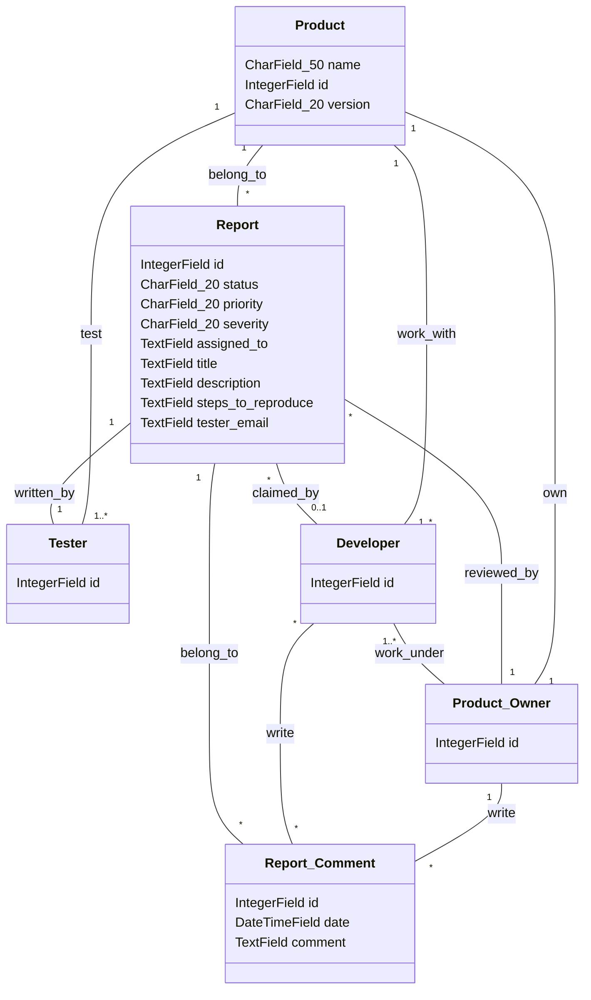

# COMP 3297 Group G Project
This project is aims at making BetaTrax, a software that links beta testers to developers and product owners.

## How to Use
Note: This is just a Minimum Viable Product. Detailed functionality (e.g. Permission checking, authentication) is not included. 

## Important docs:
- [vision doc](https://connecthkuhk-my.sharepoint.com/:w:/g/personal/u3606307_connect_hku_hk/IQD9kZZRnJiPTIxSGjKxoOG3Aex-NwIiyNTZywPfMKIx8PU?e=etTHGP)

- [use cases](https://connecthkuhk-my.sharepoint.com/:w:/g/personal/u3606307_connect_hku_hk/IQBa1r0PS0pQR6NRAKoLVzM7AddIPb8K779ircAi1OqJM6I?e=13hz48)

- [Product Backlog](https://connecthkuhk-my.sharepoint.com/:x:/g/personal/u3606307_connect_hku_hk/IQDszGtNJjNdQKKexfxhkStGATP01ZpfdjPUzL_VmQUFKXg?e=bDNYVA)

- [UI Storyboard](/COMP3297_Group_G.pdf)

- [Domain Model](#domain-model)

## Domain Model

