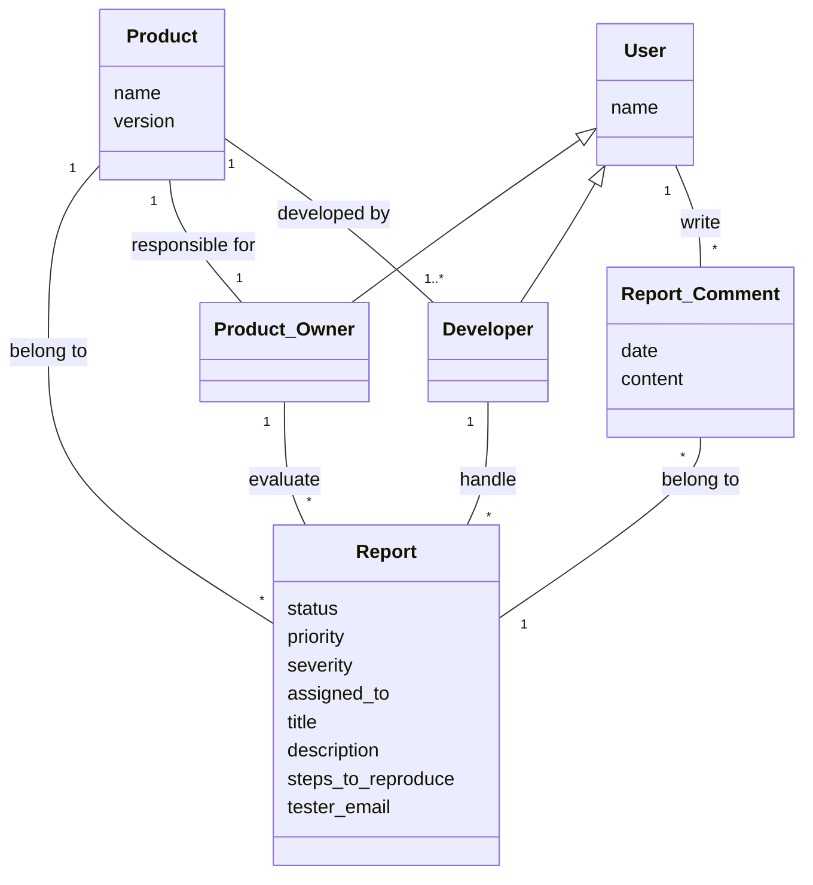

# COMP 3297 Group G Project
This project is aims at making BetaTrax, a software that links beta testers to developers and product owners.

## How to Use
Note: This is just a Minimum Viable Product. Detailed functionality (e.g. Permission checking, authentication) is not included.
### Installation
- git clone https://github.com/LinChengHao3606307/COMP_3297_Group_G_Project` in your desired directory
- Make sure Python 3.12+ (I'm on 3.14.0) is installed
- Make a virtual environment in your favourite way (ie, uv, venv, conda etc.) Install all python package dependencies using pip install -r requirements`. The library versions are the latest as of 24/3/2026. Later versions should work but just in case
- Enter the virtual environment with `source ./.venv/Scripts/activate` or something like that
- `cd src` to get to the root folder of the code or else all `python manage.py` won't work
- `python manage.py migrate` to create a database on your side.
- `python manage.py createsuperuser` to create a user that can access admin page. The admin page is `http://127.0.0.1:8000/admin`

### Commands to start the server
- `python manage.py runserver` to run the server

### Accessing the app
- Create Users (Testers, Developers, Product Owners) and Products on the admin page `http://127.0.0.1:8000/admin`. The credentials are the ones you created using `createsuperuser`. For Users, user_id can be any integer and is only used for displaying on the front end. Similarly, Product name and version can be any text. 
- Follow the GUI instructions after entering `http://127.0.0.1:8000/`, to do actions (Claim, Comment, Evaluate, Fix, Resolve) on a report, click the `url` attribute in report list page to enter the details page. Then, find the corresponding action in the `actions` provided. 

## Important docs:
- [vision doc](https://connecthkuhk-my.sharepoint.com/:w:/g/personal/u3606307_connect_hku_hk/IQD9kZZRnJiPTIxSGjKxoOG3Aex-NwIiyNTZywPfMKIx8PU?e=etTHGP)

- [use cases](https://connecthkuhk-my.sharepoint.com/:w:/g/personal/u3606307_connect_hku_hk/IQBa1r0PS0pQR6NRAKoLVzM7AddIPb8K779ircAi1OqJM6I?e=13hz48)

- [Product Backlog](https://connecthkuhk-my.sharepoint.com/:x:/g/personal/u3606307_connect_hku_hk/IQDszGtNJjNdQKKexfxhkStGATP01ZpfdjPUzL_VmQUFKXg?e=bDNYVA)

- [UI Storyboard](/COMP3297_Group_G.pdf)

- [Domain Model](#domain-model)

## Domain Model

